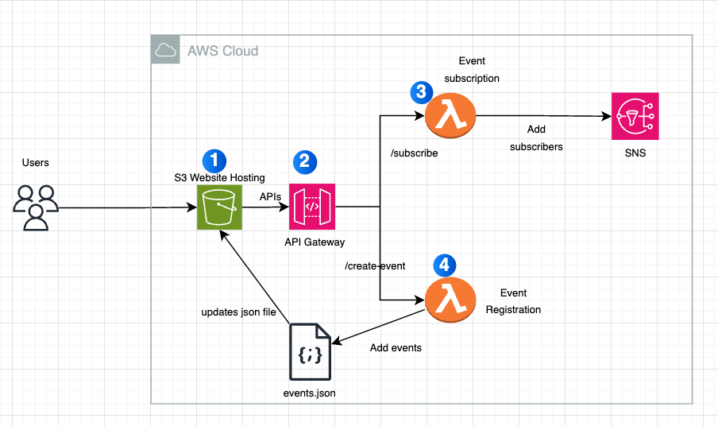

Serverless Event Announcement Platform
=======================================

# Project Overview

Develop a serverless event announcement platform that allows users to:

- Subscribe to event notifications via email.
- View a list of events.
- Create new events through a form. (only for specific users)

- Actions to be performed on S3
    -   HTML, CSS, and events.json files
    -   Enable static hosting to access the website URL.

Set up an API Gateway to handle backend processing for creating new events on /create-event and adding subscribers on /subscribe.

Subscription Lambda: adds new subscriber emails to the SNS topic.

Event Registration Lambda: updates events.json in S3 with new event details submitted from the website form and sends notifications via SNS.

# AWS Services Used

S3, SNS, Lambda, API Gateway, IAM

# Architecture Diagram

# Steps to be performed

- Set up frontend hosting with S3
- Integrate SNS Notifications for mail subscriptions and Lambda Functions for events creation and subscribe
- Setup, Test and Deploy the API Gateway
- Test and Finalize
